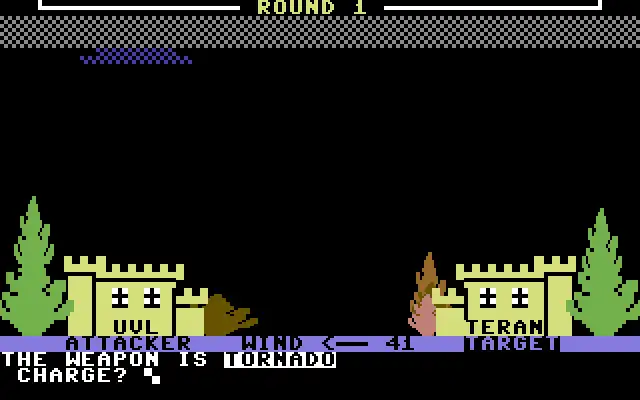

# Weatherwar II

A desktop port of [Weatherwar II](https://www.lemon64.com/game/weatherwar-2),
the 1982 Commodore 64 game by Bob Carr, published by Magic Carpet Software.

Play against another player or the computer using hail, lightning, rain and tornadoes.



## Play

Extract the ZIP for your system:

- **Windows:** run `weatherwar.exe`.
- **macOS 13+:** open `Weatherwar II.app`. Choose `arm64` for Apple Silicon or `x86_64` for Intel.
- **Linux:** run `./weatherwar`. Choose `-bundled.zip` to include runtime libraries.

Enter the players' names when prompted, or use `COMPUTER` for a computer-controlled player. The opening
screen offers instructions.

## Controls

| Key | Action |
| --- | --- |
| Return | Confirm an answer |
| Backspace | Edit an answer |
| H / L / R / T | Choose hail, lightning, rain or tornado |
| S | Show statistics when prompted |
| Q | End the game when prompted |
| F11 | Toggle fullscreen |
| Escape | Leave fullscreen; press again to quit |

After choosing a weapon, enter a charge between -150 and 150.

## Build from source

Requires a C++20 compiler, SDL3 development files, CMake 3.20+, Ninja,
Python 3, Git, Make, pkg-config, Autoconf, Automake and Libtool.
On Windows, use an MSYS2 UCRT64 shell.

```sh
make run
```

- `make check` runs the tests.
- `make release` creates ZIPs for the current system in `build/release/`.

Built with SDL3 and libresidfp (GPL-2.0-or-later).
